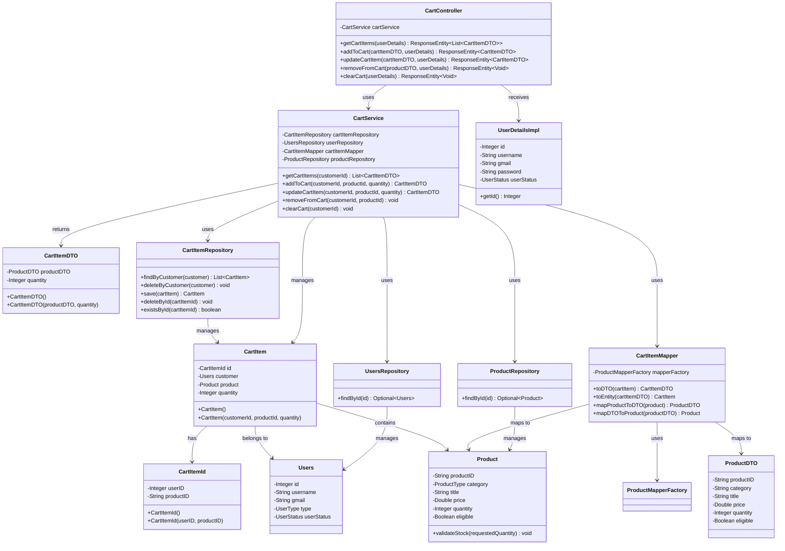
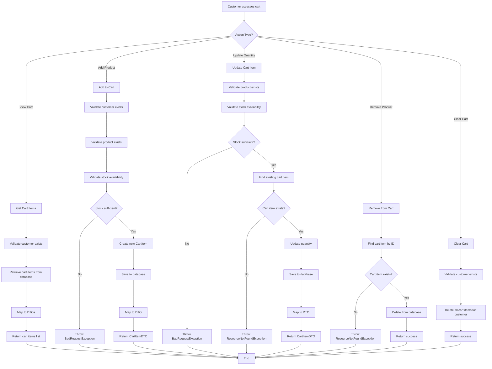
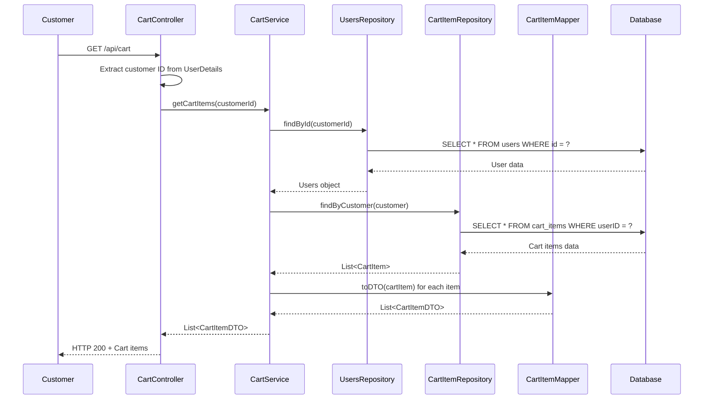
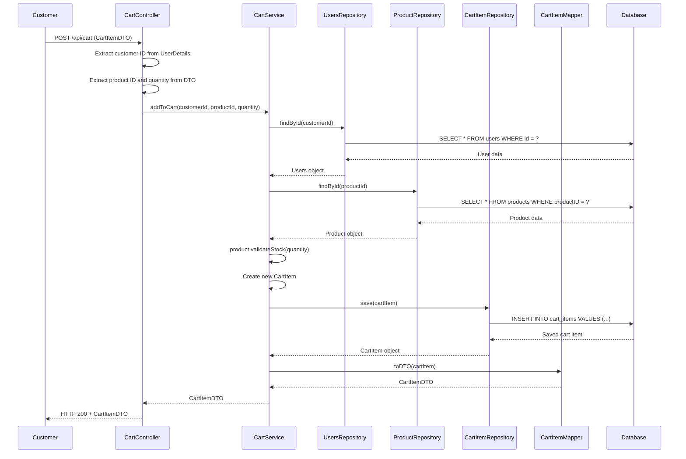
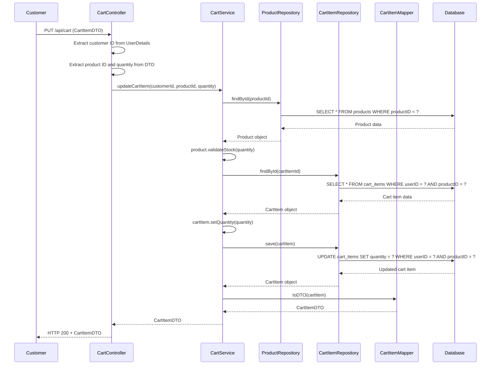
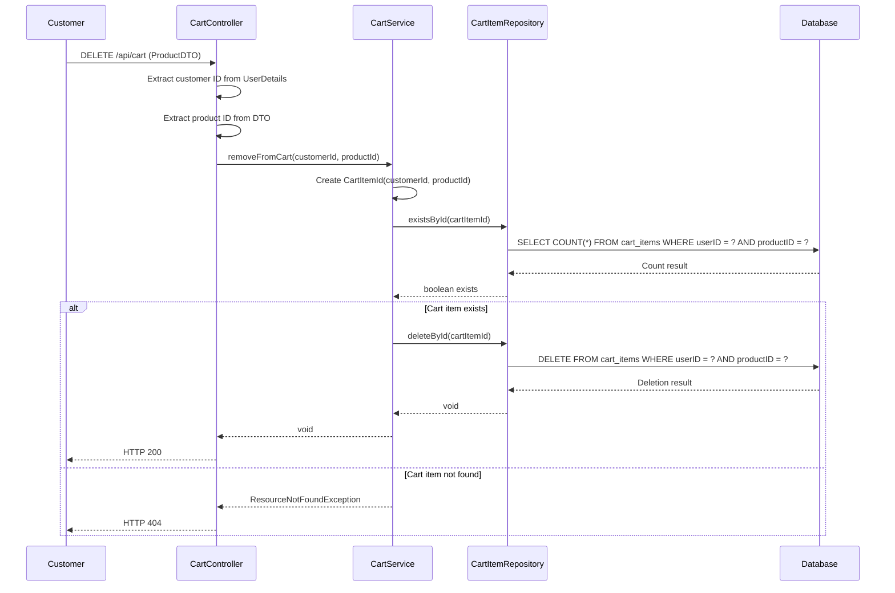
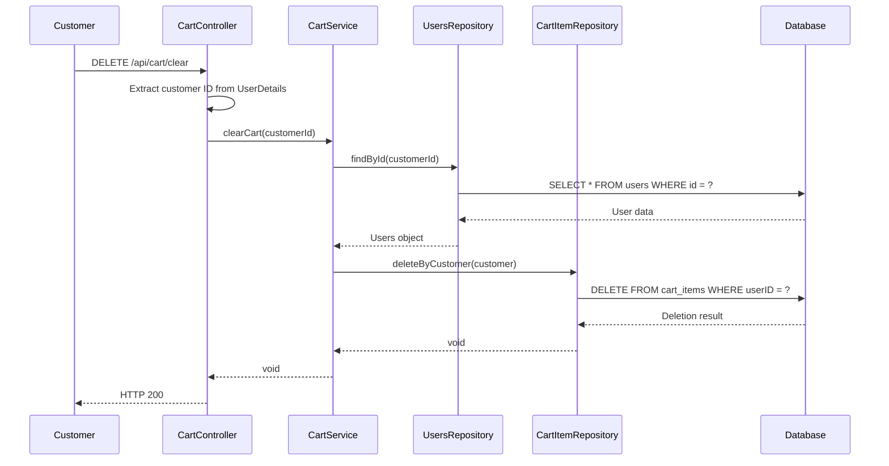

# Manage Cart Use Case - UML Diagrams

## Overview

The "Manage Cart" use case allows customers to manage their shopping cart by adding products, updating quantities, removing items, and clearing the entire cart.

## Class Diagram

## Activity Diagram

## Sequence Diagram

### 1. View Cart Items

### 2. Add Product to Cart

### 3. Update Cart Item

### 4. Remove Product from Cart

### 5. Clear Cart

## Key Components and Responsibilities

### Controllers

-   **CartController**: Handles HTTP requests and responses, extracts user information from authentication context

### Services

-   **CartService**: Contains business logic for cart operations, validates data, and coordinates between repositories

### Repositories

-   **CartItemRepository**: Manages database operations for cart items
-   **UsersRepository**: Manages user data access
-   **ProductRepository**: Manages product data access

### Mappers

-   **CartItemMapper**: Converts between entity and DTO objects using MapStruct

### Models

-   **CartItem**: JPA entity representing a cart item with embedded ID
-   **CartItemId**: Embedded ID class for composite primary key
-   **CartItemDTO**: Data transfer object for cart items

## Error Handling

The system handles various error scenarios:

-   **ResourceNotFoundException**: When customer, product, or cart item is not found
-   **BadRequestException**: When quantity is invalid or insufficient stock
-   **Validation errors**: When input data doesn't meet requirements

## Security

-   All cart operations require authentication
-   Customer can only access their own cart items
-   User ID is extracted from JWT token context
